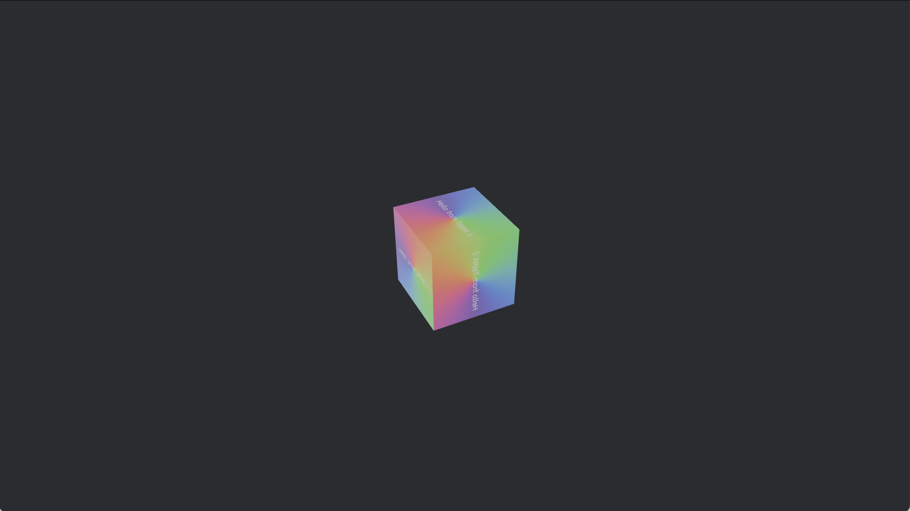

# bevy_typst_textures
[](https://crates.io/crates/bevy_typst_textures)
[](./examples/default_fonts_3d.rs)

A simple `Resource` for generating rasterized textures (`Handle<Image>`) out of either standalone .typ files or structured, zipped typst projects, built on `typst-as-lib`.

# Example

To use this crate, add the `TypstTexturesPlugin` to your bevy app then request textures through `TypstTextureServer`:

```rust
use bevy::prelude::*;
use bevy_typst_textures::{TypstJobOptions, TypstTextureServer, TypstTexturesPlugin};

fn main() {
    App::new()
        .add_plugins((DefaultPlugins, TypstTexturesPlugin::default()))
        .add_systems(Startup, start)
        .run();
}

fn start(mut commands: Commands, mut typst_server: ResMut<TypstTextureServer>) {
    commands.spawn(Camera2d);
    commands.spawn(Sprite {
        image: typst_server.add_job("my_zip_in_the_asset_folder.zip".into(), TypstJobOptions::default()),
        ..default()
    });
    commands.spawn(Sprite {
        image: typst_server.add_job_with_dict_input("my_zip_in_the_asset_folder.zip".into(), typst::foundations::Dict::new(), TypstJobOptions::default()),
        ..default()
    });
}
```

## Expected structure for Typst Assets

Standalone `.typ` files can be loaded, but they will not have access to the bevy `asset/` folder or any other .typ files and if you want to display text then either the `typst-search-system-fonts` or `typst-asset-fonts` features must be enabled.

For complex typst projects that need access to guaranteed, specific fonts as well as other assets, you'll need to create a **`.zip`** archive containing:
1. a **`main.typ`** file.
2. an optional `package.toml` file:
    - This doesn't need to be populated with anything right now.
    - That said, it expects:
        - a name field
        - a list of author strings
        - a list of bevy `asset/` folder asset requests (doesn't do anything right now)
        - a list of typst "universe" package requests (doesn't do anything right now)
3. Any .otf fonts needed (they can exist anywhere, but a `fonts/` folder is a good idea)
    - unless either of the `typst-search-system-fonts` or `typst-asset-fonts` crate features are enabled, which will enable use of system fonts or the "default" typst fonts as embedded assets, respectively. This does still put the onus on you and your users to have these fonts either installed or bundled.
4. Typst modules, assets, images, SVGs, data, etc.

## Limitations

This project is built on top of the `typst-as-lib` crate, which provides a nice wrapper over the internals of `typst` for standalone projects. The limitations of `typst-as-lib` are inherited by this crate.

This package expects typst assets as zip archives to simplify the asset-fetching process (as outlined above).

Packages are supported, but not on web. This may change in the future, but for now this does not work.

The archive unzipping is a bit fragile right now. Lots of `unwrap`s and assumptions about how different OSs handle zip archives, and some ad-hoc dealing with how they pollute filesystems with metadata (`__MACOS/` delenda est). Because zipping manually is a pain, I'd suggest setting up something to create zips of your typst assets folders in a `build.rs` script or as part of a watch command on your project.

## Cargo Features

All these features are pass-through features to `typst-as-lib` features. `typst-asset-fonts` is the only default feature.

- `typst-packages`: Enable access to Universe packages. Package fetching is blocking, doesn't work on web, and relies on you also enabling one of the following:
    - `typst-resolve-ureq`: Use `ureq` to resolve packages.
    - `typst-resolve-reqwest`: Use `reqwest` to resolve packages.
- `typst-search-system-fonts`: Allow access to system fonts from Typst.
- `typst-asset-fonts`: Embed the "default" fonts of typst, embedding them directly in the program's executable.

## Running on Web

Remember to set appropriate [`getrandom` build configuration](https://docs.rs/getrandom/0.3.3/#webassembly-support) if you try to run this on web.

## Why not [`Velyst`](https://github.com/voxell-tech/velyst)?

This crate sits in the niche of needing rasterized textures rather than full & interactive typst integration. Velyst is much more powerful than this crate, but also exists in a different niche.

## Feature Creep

Planned features:

- Move typst compilation & rasterization to the async compute pool completely.
- Support for loading of .tar.gz archives.
- If/when `typst-as-lib` supports packages in the browser, support packages in the browser.
- Optional resizing of rasterized Typst output before adding it to Bevy's asset management.
- Optionally rasterize multi-page output to a texture atlas.
- Trim down dependencies, or at least feature gate more of them.

## Versions

|`bevy_typst_textures`|Typst|Bevy|
|-|-|-|
|0.3.0|0.14|0.17|
|0.2.0|0.13|0.17|
|0.1.1|0.13|0.16|

## Licence

This is published under a dual MIT & Apache 2.0 licence, as is generally kosher for the bevy ecosystem.